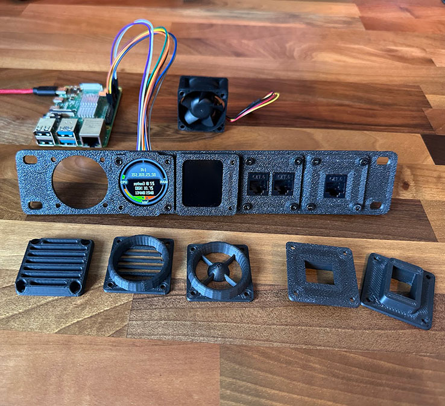

# Waveshare Mini LCD Screen Code 

## **1.28 Inch Round SPI Screen:**

**I've setup this screen to report on:**

 - CPU Usage bar - top left
 - Ram usage bar - top right
 - WAN download - bottom left
 - WAN upload - bottom right
 - Then down the middle
	 - Hostname
	 - IP Address
	 - Application with most CPU usage (inc %)
	 - Disk space % used
	 - Amount of data downloaded/uploaded since reboot

This is just an example for you to use this is not provided as a finished product.

Here are my related 3D models as pictured below:
https://makerworld.com/@n3rding/collections/5667731-10-inch-40mm-fan-bay

**Instructions to setup Pi:**
This should be the same as the official Waveshare instructions, if in doubt or issues follow their instructions, my code uses the lib folder above the example folder so my scripts should be copied in to the example folder or references updated.

The script above should be copied to the example folder or paths updated, the image I have used on the screen is in the default home directory found at /home/pi/ but feel free to change the path.

    #Enable SPI
    sudo raspi-config
    Choose Interfacing Options -> SPI -> Yes  to enable SPI interface
    sudo reboot
    
    #Install Python
    sudo apt-get update
    sudo apt-get install python3-pip
    sudo apt-get install python3-pil
    sudo apt-get install python3-numpy
    sudo apt install python3-rpi.gpio
    sudo apt-get install python3-psutil
    
    
    #Download examples
    sudo apt-get install unzip -y
    sudo wget https://files.waveshare.com/upload/8/8d/LCD_Module_RPI_code.zip
    sudo unzip ./LCD_Module_RPI_code.zip 
    cd LCD_Module_RPI_code/RaspberryPi/python/example/
    
    #Download my files
    sudo wget https://github.com/jebbett/waveshare-lcd/blob/main/example/stats.py
    sudo wget https://github.com/jebbett/waveshare-lcd/blob/main/example/image.png
    sudo wget https://github.com/jebbett/waveshare-lcd/blob/main/example/Font02.ttf

